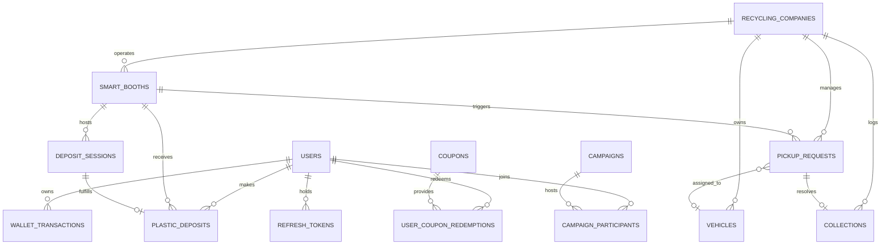

# GREENIFY: SYSTEM IMPLEMENTATION PLAN

## 1. Executive Summary & Architecture Overview

**Greenify** is a Smart Plastic Collection & Reward System for Bangladesh designed to connect:
- **Citizens (Users)** who deposit recyclable plastic and earn rewards withdrawable via bKash.
- **Smart Collection Booths** (simulated hardware nodes) that measure plastic weight and send telemetry data.
- **Recycling Companies** that track booth fill status, manage vehicles, and collect accumulated plastic.
- **System Administrators** who manage users, booths, company approvals, economics, coupons, and view analytics/audit logs.

### Tech Stack Blueprint
```
+-------------------------------------------------------------------------------+
|                             FLUTTER MOBILE APP                                |
|          (Material 3, Riverpod, GoRouter, Dio, SecureStorage, FL Chart)       |
|    +--------------------+  +-----------------------+  +------------------+    |
|    |     User Shell     |  | Recycling Company Shell|  |   Admin Shell    |    |
|    +--------------------+  +-----------------------+  +------------------+    |
+---------------------------------------+---------------------------------------+
                                        | HTTPS / REST (JWT Auth)
                                        v
+-------------------------------------------------------------------------------+
|                             SPRING BOOT 3.x BACKEND                           |
|          (Java 17/21, Spring Security 6, Spring Data JPA, Flyway, OpenAPI)    |
|    +------------------+  +------------------+  +-------------------------+    |
|    | Auth & OTP Engine|  | Economics Engine |  | Pickup & Priority Queue |    |
|    +------------------+  +------------------+  +-------------------------+    |
|    +---------------------------------------------------------------------+    |
|    |                   PayoutGateway (Mock / bKash B2C API)              |    |
|    +---------------------------------------------------------------------+    |
+---------------------------------------+---------------------------------------+
                                        | JDBC / InnoDB
                                        v
+-------------------------------------------------------------------------------+
|                             MYSQL 8 DATABASE (3NF)                            |
|             (Strict Constraints, Indexes, Views, Stored Ledger)               |
+-------------------------------------------------------------------------------+
```

---

## 2. Token & Cashback Economics (Authoritative)

- **Token Earning Rate:** 100 Tokens per 1 kg (1 Token per 10 grams). Discards grams remainder under 10g (`base_tokens = floor(weight_kg * 100)`).
- **Cashback Rate:** 4 Tokens = ৳1.00 BDT.
- **Effective Consumer Value:** ৳25.00 BDT per kg.
- **Minimum Withdrawal:** ৳100.00 BDT (400 Tokens).
- **Withdrawal Step:** Tokens withdrawn must be a multiple of 4.
- **Wallet Architecture:** Single authoritative balance `total_tokens` in `users` table. Computed `wallet_balance` stored generated column (`total_tokens / 4`). Append-only transaction ledger (`wallet_transactions`) audited against total balance.
- **Payout Gateway:** Pluggable `PayoutGateway` interface with `MockPayoutGateway` (default, simulates instant success and failure handling) and `BkashPayoutGateway` (B2C disbursement API configuration).

---

## 3. Database Design (MySQL 8, 3NF & Lab Requirements)

### 3.1 Entity-Relationship (ER) Diagram


### 3.2 Key Database Schema Constraints
1. `users`: `user_id` (PK), `phone_number` (UNIQUE), `bkash_number` (NULLABLE until 1st withdrawal), `total_tokens` (CHECK >= 0), `wallet_balance` (STORED GENERATED `total_tokens / 4`), `role` (ENUM: 'USER', 'COMPANY', 'ADMIN'), `status` ('ACTIVE', 'SUSPENDED').
2. `recycling_companies`: `company_id` (PK), `registration_number` (UNIQUE), `contact_email` (UNIQUE), `status` ('PENDING', 'ACTIVE', 'REJECTED', 'SUSPENDED').
3. `smart_booths`: `booth_id` (PK), `booth_code` (UNIQUE), `company_id` (FK), `capacity_kg` (CHECK > 0), `current_weight_kg` (CHECK >= 0), `booth_status` ('Empty', 'Available', 'Almost Full', 'Full', 'Under Maintenance', 'Offline').
4. `plastic_deposits`: `deposit_id` (PK), `session_id` (FK UNIQUE), `plastic_weight_kg` (DECIMAL(8,3) CHECK > 0), `tokens_earned` (INT CHECK >= 0), `rate_snapshot` (INT).
5. `wallet_transactions`: `transaction_id` (PK), `user_id` (FK), `tokens_delta` (INT), `cash_delta` (DECIMAL(10,2)), `status` ('Pending', 'Completed', 'Failed'), `idempotency_key` (VARCHAR UNIQUE), `bkash_trx_id` (VARCHAR UNIQUE NULL).
6. `pickup_requests`: `request_id` (PK), `request_code` (UNIQUE), `booth_id` (FK), `company_id` (FK), `vehicle_id` (FK NULL), `priority` ('HIGH', 'NORMAL'), `status` ('Pending', 'Accepted', 'Vehicle Assigned', 'On Pickup', 'Completed', 'Cancelled').
7. `vehicles`: `vehicle_id` (PK), `company_id` (FK), `vehicle_number` (UNIQUE), `status` ('Available', 'Assigned', 'On Pickup', 'Maintenance').

### 3.3 DBMS Lab Required Query Features
- **DML:** Complete CRUD across all domain entities.
- **Aggregation & GROUP BY / HAVING:** User lifetime plastic aggregation for automated loyalty calculation.
- **Joins (Inner & Left):** `INNER JOIN` deposits/users; `LEFT JOIN` unassigned booths/companies.
- **Subqueries:** Identifying high-impact recyclers exceeding platform average withdrawal amounts.
- **Views:** `vw_booth_status_summary` calculating real-time capacity usage %, fill state, and assigned company details.
- **ACID Transactions:** Row-locking (`SELECT FOR UPDATE`) on balance debits, coupon redemptions, QR session verification, and pickup completion.
- **Indexes:** `idx_deposit_user_date`, `idx_ledger_user_date`, `idx_pickup_company_status`.

---

## 4. REST API Endpoint Summary

### Auth & User (`/api/v1/auth`, `/api/v1/me`)
- `POST /auth/otp/send`, `POST /auth/otp/verify` (Sign-up verification & password reset)
- `POST /auth/register/user`, `POST /auth/register/company`
- `POST /auth/login`, `POST /auth/refresh`, `POST /auth/logout`
- `POST /auth/password/forgot`, `POST /auth/password/verify`, `POST /auth/password/reset`
- `GET /me`, `PUT /me`, `GET /me/dashboard`, `GET /me/wallet`, `GET /me/transactions`, `GET /me/deposits`
- `POST /me/withdraw` (Requires `Idempotency-Key` header)
- `GET /coupons`, `POST /coupons/{id}/redeem`, `GET /me/coupons`
- `POST /deposit-sessions`, `GET /leaderboard`

### Booth Integration (`/api/v1/booths`)
- `POST /booths/{id}/qr` (Generates short-lived QR code, TTL default 60s)
- `POST /booths/{id}/deposit-sessions/{sessionId}/weight` (Submits scale weight from booth hardware/simulator)
- `POST /booths/{id}/heartbeat`

### Recycling Company Portal (`/api/v1/company`)
- `GET /company/dashboard`, `GET /company/booths`, `GET /company/booths/{id}`
- `POST /company/booths/{id}/pickup-requests`
- `GET /company/pickup-requests`, `POST /company/pickup-requests/{id}/accept`, `/assign-vehicle`, `/start`, `/complete`
- `GET/POST/PUT /company/vehicles`
- `GET /company/collections`, `GET /company/collections/export` (CSV)
- `GET /company/notifications`, `PUT /company/notifications/{id}/read`

### Admin Portal (`/api/v1/admin`)
- `GET /admin/dashboard/metrics`, `GET /admin/dashboard/chart`
- `GET/PUT /admin/users/{id}`, `POST /admin/users/{id}/suspend`
- `GET /admin/companies/pending`, `POST /admin/companies/{id}/approve`, `/reject`
- `GET/POST/PUT /admin/booths`
- `GET/PUT /admin/config/economics` (Edit reward rates & cashback rates)
- `GET/POST/PUT /admin/coupons`
- `GET/POST/PUT /admin/campaigns`
- `GET /admin/reports/export`, `GET /admin/audit-logs`, `GET /admin/search`

---

## 5. Mobile App Architecture & Visual Branding

### Branding & Theme System
- **Primary Color:** `#2E6027` (Deep Forest Green, derived from logo asset)
- **Primary Light:** `#3D7A35`
- **Accent Color:** `#6BBF3A` (Vibrant Leaf Green)
- **Background Color:** `#F2F5F1` (Clean Soft Off-White)
- **Surface Color:** `#FFFFFF`
- **Typography:** Inter / Roboto with Material 3 design spec.
- **Branding Integration:** Use `Logo/Greenify-01-01.png` and `Logo/Greenify-01.svg` in Auth headers, App Bars, Splash screen, and visual card overlays.

### Single App with Role-Based Shell Routing
- Role determined on login from JWT payload (`USER`, `COMPANY`, `ADMIN`).
- **User Navigator:** Home Dashboard, QR Scanner, Wallet & bKash Withdraw, Coupons Store, Impact & Leaderboard, Profile.
- **Company Navigator (Figma specification):** Home Dashboard, Smart Booths, Pickup Requests, Collection History, Alerts, Vehicles, Profile.
- **Admin Navigator (Figma Make React Prototype translation):** Home, Users, Operations (Booths, Collections, Companies Queue), Finance (Rewards, Cashback Config, Coupons), More (Loyalty, Campaigns, Reports, Audit Logs, Settings).

---

## 6. Development & Modular Git Branch Strategy

To accommodate manual feature-by-feature git pushing by the user:

1. **Phase 1 Branch (`feature/phase-1-foundation-and-backend-auth`):**
   - Repository restructuring (`backend/`, `mobile/`, `docs/`, `sql/`, `design/admin-prototype/`).
   - Copy existing React admin prototype into `design/admin-prototype/`.
   - Spring Boot 3 initialization with MySQL & Flyway migration scripts (`V1__init_schema.sql`, `V2__seed_data.sql`).
   - Security framework (JWT, Password Hashing, Pluggable OTP engine with test mode `123456`).
   - Backend Auth & User/Company registration REST endpoints.
   - Comprehensive unit and integration tests.

2. **Phase 2 Branch (`feature/phase-2-economics-booth-sim-wallet`):**
   - `EconomicsService`, `wallet_transactions` ledger, row locking, and idempotency protection.
   - bKash `PayoutGateway` (Mock + B2C Disbursement implementation skeleton).
   - Dynamic QR generation & Deposit Session state machine.
   - Spring Boot dev-profile Booth Simulator HTML/REST endpoint.
   - Unit tests for deposit calculations, withdrawal multiples of 4, ৳100 minimum threshold, and concurrency.

3. **Phase 3 Branch (`feature/phase-3-company-booths-pickups`):**
   - Booth fill status automated state transitions (`Empty` -> `Available` -> `Almost Full` -> `Full`).
   - Automated pickup request generation and FIFO/priority queue (`Full` > `Almost Full`).
   - Vehicle assignment logic and single-vehicle locking.
   - Company pickup lifecycle endpoints (`Accept` -> `Assign Vehicle` -> `On Pickup` -> `Complete`).

4. **Phase 4 Branch (`feature/phase-4-flutter-foundation-auth-user`):**
   - Flutter application initialization, Riverpod state providers, GoRouter navigation.
   - Brand UI System using logo tokens (`#2E6027`, `#6BBF3A`, logo assets).
   - Auth Screens (Sign Up 2-step OTP flow, Login, Company Registration, OTP Password Reset).
   - User Dashboard, Mobile Scanner QR Deposit screen, Wallet & Live bKash Cashout UI, Coupons & Impact views.

5. **Phase 5 Branch (`feature/phase-5-flutter-company-portal`):**
   - 390px mobile visual translation of Figma Recycling Company portal.
   - Company Dashboard, Smart Booth List & Detail, Pickup Request feed, Vehicle management, Collection History with search/filters, Alerts.

6. **Phase 6 Branch (`feature/phase-6-flutter-admin-portal-and-docs`):**
   - Translation of React Admin Prototype into Flutter Admin Shell.
   - Admin Home, User Detail/Actions, Operations (Booths, Collections, Company Approval Queue), Finance (Reward Rule Editor with Audit log modal, Cashback Config, Coupon Form), Campaigns, Audit Log Viewer, Global Search.
   - SQL Lab Deliverables (`sql/schema.sql`, `sql/seed.sql`, `sql/views.sql`, `sql/queries.sql`, `sql/procedures.sql`, `docs/SQL_FEATURES.md`).
   - Comprehensive README & Docker Compose validation.

---

## 7. Verification & Quality Assurance Plan

### Backend Automated Verification
- `mvn test` running JUnit 5 tests covering:
  - 1.000 kg deposit = 100 tokens.
  - 1.500 kg deposit = 150 tokens.
  - Withdrawal validation: rejected under 400 tokens (৳100 minimum), rejected if not multiple of 4, rejected if balance insufficient.
  - Failed payout rollback verification.
  - Session single-use QR token expiration and reuse prevention.
  - Concurrent deposit/withdrawal row lock test.

### Mobile App Verification
- Flutter widget tests for Auth OTP input, bKash withdraw form validation, role-based navigation guards.
- Manual end-to-end verification using simulated booth web page (`/sim`) and mobile scanner.
